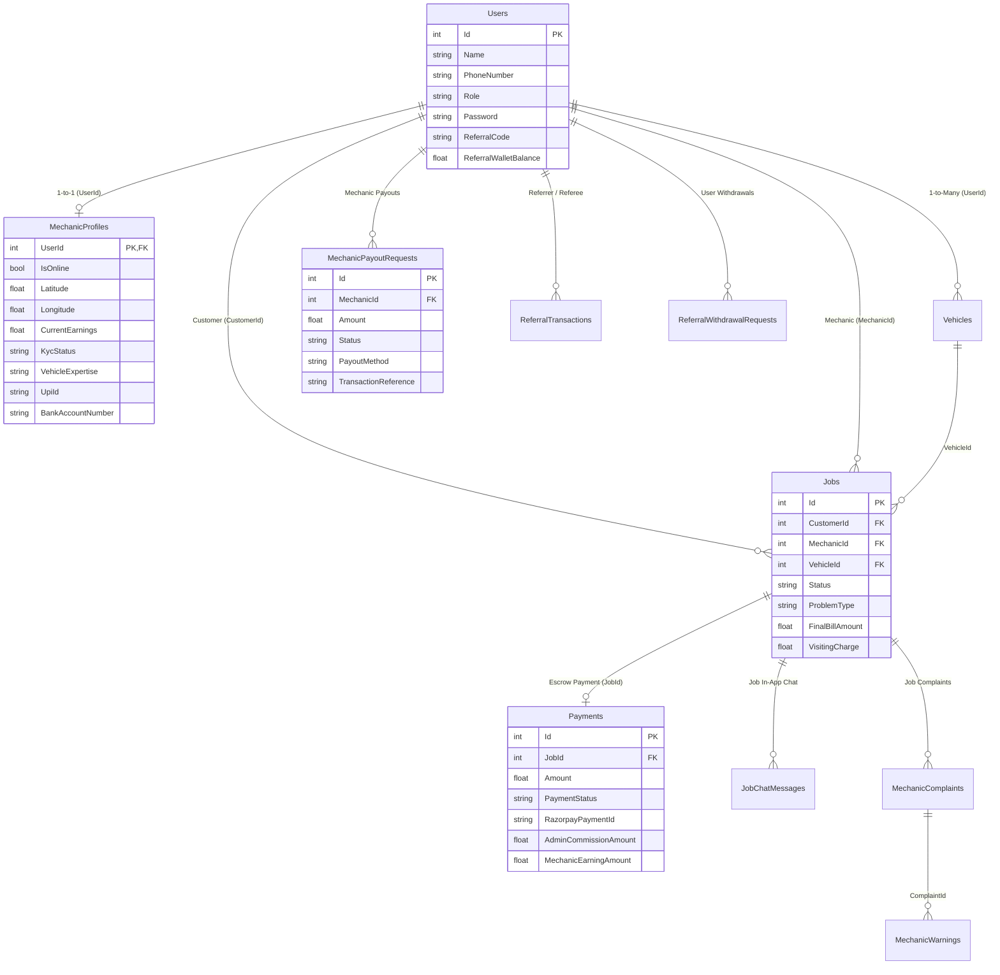

# 📚 RaahSathi Database & Stored Procedures Technical Reference Manual
> **Complete Database Documentation: Table-by-Table Schema, Business Logic, and Full Stored Procedures Catalog**
> 
> *Generated for RaahSathi Enterprise Platform | Database: Microsoft SQL Server (`RaahSathiDb`)*
> *All Stored Procedures standardized to: `rs_tablename_action`*

---

## 📑 Table of Contents (विषय-सूची)
1. [Overview & Database Architecture (आर्किटेक्चर विवरण)](#1-overview--database-architecture)
2. [Database Tables Catalog (सभी टेबल्स और उनका विवरण)](#2-database-tables-catalog)
   - [2.1 Core Identity & User Tables (उपयोगकर्ता और प्रोफाइल)](#21-core-identity--user-tables)
     - [Users (`dbo.Users`)](#1-users-dbousers)
     - [MechanicProfiles (`dbo.MechanicProfiles`)](#2-mechanicprofiles-dbomechanicprofiles)
     - [Vehicles (`dbo.Vehicles`)](#3-vehicles-dbovehicles)
   - [2.2 Breakdown & Job Booking Management (जॉब और बुकिंग)](#22-breakdown--job-booking-management)
     - [Jobs (`dbo.Jobs`)](#4-jobs-dbojobs)
     - [Payments (`dbo.Payments`)](#5-payments-dbopayments)
     - [JobChatMessages (`dbo.JobChatMessages`)](#6-jobchatmessages-dbojobchatmessages)
   - [2.3 Financial & Payout Management (वॉलेट और भुगतान)](#23-financial--payout-management)
     - [MechanicPayoutRequests (`dbo.MechanicPayoutRequests`)](#7-mechanicpayoutrequests-dbomechanicpayoutrequests)
     - [AdminWithdrawals (`dbo.AdminWithdrawals`)](#8-adminwithdrawals-dboadminwithdrawals)
     - [MechanicSubscriptions (`dbo.MechanicSubscriptions`)](#9-mechanicsubscriptions-dbomechanicsubscriptions)
   - [2.4 Referral Program Engine (रेफरल और रिवॉर्ड्स)](#24-referral-program-engine)
     - [ReferralProgramSettings (`dbo.ReferralProgramSettings`)](#10-referralprogramsettings-dboreferralprogramsettings)
     - [ReferralTransactions (`dbo.ReferralTransactions`)](#11-referraltransactions-dboreferraltransactions)
     - [ReferralWithdrawalRequests (`dbo.ReferralWithdrawalRequests`)](#12-referralwithdrawalrequests-dboreferralwithdrawalrequests)
   - [2.5 Governance, Trust & Support (शिकायतें, चेतावनियां और सपोर्ट)](#25-governance-trust--support)
     - [MechanicComplaints (`dbo.MechanicComplaints`)](#13-mechaniccomplaints-dbomechaniccomplaints)
     - [MechanicWarnings (`dbo.MechanicWarnings`)](#14-mechanicwarnings-dbomechanicwarnings)
     - [ContactMessages (`dbo.ContactMessages`)](#15-contactmessages-dbocontactmessages)
     - [MechanicSupportMessages (`dbo.MechanicSupportMessages`)](#16-mechanicsupportmessages-dbomechanicsupportmessages)
   - [2.6 Pricing & City Operations (प्राइसिंग और शहर प्रबंधन)](#26-pricing--city-operations)
     - [PricingRules (`dbo.PricingRules`)](#17-pricingrules-dbopricingrules)
     - [ProblemTypePricings (`dbo.ProblemTypePricings`)](#18-problemtypepricings-dboproblemtypepricings)
     - [CityServiceAreas (`dbo.CityServiceAreas`)](#19-cityserviceareas-dbocityserviceareas)
     - [CustomServices (`dbo.CustomServices`)](#20-customservices-dbocustomservices)
   - [2.7 CMS, Notifications & Auditing (सिस्टम सेटिंग और लॉग्स)](#27-cms-notifications--auditing)
     - [CmsBanners (`dbo.CmsBanners`)](#21-cmsbanners-dbocmsbanners)
     - [PushNotificationLogs (`dbo.PushNotificationLogs`)](#22-pushnotificationlogs-dbopushnotificationlogs)
     - [AuditLogs (`dbo.AuditLogs`)](#23-auditlogs-dboauditlogs)
     - [AdminSystemSettings (`dbo.AdminSystemSettings`)](#24-adminsystemsettings-dboadminsystemsettings)
     - [SystemApiSettings (`dbo.SystemApiSettings`)](#25-systemapisettings-dbosystemapisettings)
     - [SystemContactSettings (`dbo.SystemContactSettings`)](#26-systemcontactsettings-dbosystemcontactsettings)
     - [DataProtectionKeys (`dbo.DataProtectionKeys`)](#27-dataprotectionkeys-dbodataprotectionkeys)
3. [Stored Procedures Catalog (सभी 100% rs_tablename_action SPs)](#3-stored-procedures-catalog)
   - [SP 1: `dbo.rs_payments_process_job`](#sp-1-dbors_payments_process_job)
   - [SP 2: `dbo.rs_mechanicpayoutrequests_create`](#sp-2-dbors_mechanicpayoutrequests_create)
   - [SP 3: `dbo.rs_mechanicpayoutrequests_process`](#sp-3-dbors_mechanicpayoutrequests_process)
   - [SP 4: `dbo.rs_users_update_profile`](#sp-4-dbors_users_update_profile)
   - [SP 5: `dbo.rs_mechanicprofiles_update_bank_details`](#sp-5-dbors_mechanicprofiles_update_bank_details)
   - [SP 6: `dbo.rs_systemapisettings_get`](#sp-6-dbors_systemapisettings_get)
   - [SP 7: `dbo.rs_systemapisettings_save_or_update`](#sp-7-dbors_systemapisettings_save_or_update)
   - [SP 8: `dbo.rs_systemcontactsettings_get`](#sp-8-dbors_systemcontactsettings_get)
   - [SP 9: `dbo.rs_systemcontactsettings_save_or_update`](#sp-9-dbors_systemcontactsettings_save_or_update)
   - [SP 10: `dbo.rs_payments_process_escrow`](#sp-10-dbors_payments_process_escrow)
   - [SP 11: `dbo.rs_adminwithdrawals_insert`](#sp-11-dbors_adminwithdrawals_insert)
   - [SP 12: `dbo.rs_mechanicprofiles_withdraw_wallet`](#sp-12-dbors_mechanicprofiles_withdraw_wallet)
4. [Mermaid Entity-Relationship Diagram](#4-mermaid-entity-relationship-diagram)
5. [Summary Table: SPs & Calling Locations](#5-summary-table-sps--calling-locations)

---

# 1. Overview & Database Architecture

RaahSathi (राहसाथी) एक 24x7 ऑन-डिमांड रोडसाइड असिस्टेंस और वेहिकल ब्रेकडाउन प्लेटफॉर्म है। 
- **Primary Database Engine:** Microsoft SQL Server (`Server=AmanYadav-PC\SQLEXPRESS;Database=RaahSathiDb;`)
- **ORM / Data Access:** Entity Framework Core 9.0 + Raw SQL Stored Procedures Execution via Dapper/ADO.NET patterns.
- **Naming Rule Enforced:** All platform stored procedures strictly conform to **`rs_tablename_action`**.
- **Concurrency & Transaction Safety:** Stored Procedures को ACID कम्प्लायंट बनाया गया है, जिसमें `UPDLOCK`, `ROWLOCK`, `HOLDLOCK`, और `BEGIN TRANSACTION / COMMIT / ROLLBACK` के साथ ऑटोमैटिक रेस-कंडीशन प्रोटेक्शन है।
- **Automatic Audit Trail:** `ApplicationDbContext.cs` में `SaveChangesAsync` को ओवरराइड किया गया है। जब भी किसी टेबल में डेटा `INSERT`, `UPDATE`, या `DELETE` होता है, तो उसका पुराना और नया मान स्वतः `AuditLogs` टेबल में कैप्चर हो जाता है।

---

# 2. Database Tables Catalog

---

## 2.1 Core Identity & User Tables

### 1. Users (`dbo.Users`)
- **C# Model:** `RaahSathi.Models.User` ([User.cs](file:///c:/Users/aky83/RaahSathi/Models/User.cs))
- **Purpose (क्या सेव होता है):**
  इस टेबल में सिस्टम के सभी रजिस्टर्ड यूज़र्स (Customer, Mechanic, Admin) की कोर डिटेल्स सेव होती हैं। कस्टमर्स के लिए अलग टेबल नहीं है, बल्कि `Role = 'Customer'` के रूप में इसी टेबल में सेव होते हैं।

| Column Name | Data Type | Nullable | Default | Description & Business Value |
| :--- | :--- | :--- | :--- | :--- |
| `Id` | `INT` (PK, Identity) | No | Auto | यूनिक यूज़र आईडी। |
| `Name` | `NVARCHAR(100)` | No | - | यूज़र का पूरा नाम। |
| `PhoneNumber` | `NVARCHAR(20)` | No | - | यूज़र का 10-अंकीय मोबाइल नंबर (लॉगिन आइडेंटिफ़ायर)। |
| `Role` | `NVARCHAR(20)` | No | 'Customer' | यूज़र का मुख्य रोल: `'Customer'`, `'Mechanic'`, या `'Admin'`. |
| `Password` | `NVARCHAR(100)` | No | - | हैशेड पासवर्ड। |
| `CreatedAt` | `DATETIME2` | No | UTC Now | रजिस्ट्रेशन की तारीख और समय। |
| `IsBlocked` | `BIT` | No | 0 (false) | 1 होने पर यूज़र लॉगिन और बुकिंग से ब्लॉक रहता है। |
| `AdminRole` | `NVARCHAR(50)` | No | 'Super Admin' | एडमिन का सब-रोल (`Super Admin`, `Finance`, `Support`, `Operations`, `Marketing`, `Moderator`). |
| `ReferralCode` | `NVARCHAR(50)` | No | '' | यूज़र का यूनिक रेफरल कोड (दूसरों को इनवाइट करने के लिए)। |
| `ReferredByCode` | `NVARCHAR(50)` | Yes | NULL | जिस व्यक्ति के कोड से साइन-अप किया गया उसका कोड। |
| `ReferralWalletBalance` | `FLOAT` | No | 0.0 | रेफरल रिवार्ड्स से अर्जित कुल वॉलेट बैलेंस (रुपये में)। |

- **Calculated Property (Not Mapped):**
  - `DisplayId`: रोल के अनुसार कस्टम कोड जैसे Customer के लिए `RS01C`, Mechanic के लिए `RS01M`, Admin के लिए `RS01A`.

---

### 2. MechanicProfiles (`dbo.MechanicProfiles`)
- **C# Model:** `RaahSathi.Models.MechanicProfile` ([MechanicProfile.cs](file:///c:/Users/aky83/RaahSathi/Models/MechanicProfile.cs))
- **Purpose (क्या सेव होता है):**
  मैकेनिक की विस्तृत प्रोफ़ाइल, जीपीएस लाइव लोकेशन, ऑनलाइन स्टेटस, ई-रिक्शा / ऑटो / कार एक्सपर्टीज, केवाईसी (Aadhaar, PAN, DL, Selfie, Shop Photo), बैंक / UPI विवरण, सब्सक्रिप्शन स्टेटस, और **CurrentEarnings (डिजिटल वॉलेट बैलेंस)**।

| Column Name | Data Type | Nullable | Default | Description & Business Value |
| :--- | :--- | :--- | :--- | :--- |
| `UserId` | `INT` (PK, FK) | No | - | `Users.Id` से जुड़ा प्राथमिक कुंजी (1-to-1). |
| `IsOnline` | `BIT` | No | 0 (Offline) | क्या मैकेनिक अभी ड्यूटी पर ऑनलाइन है और जॉब्स स्वीकार कर सकता है। |
| `Latitude` | `FLOAT` | No | 0.0 | मैकेनिक की लाइव या सिम्युलेटेड जीपीएस लैटिट्यूड। |
| `Longitude` | `FLOAT` | No | 0.0 | मैकेनिक की लाइव या सिम्युलेटेड जीपीएस लॉन्गिट्यूड। |
| `Rating` | `FLOAT` | No | 5.0 | औसत कस्टमर रेटिंग (1.0 से 5.0)। |
| `TotalJobs` | `INT` | No | 0 | मैकेनिक द्वारा पूरी की गई कुल जॉब्स की संख्या। |
| `KycStatus` | `NVARCHAR(20)` | No | 'Pending' | केवाईसी स्थिति: `'Pending'`, `'Approved'`, `'Rejected'`. |
| `AadhaarNumber` | `NVARCHAR(50)` | No | '' | 12 अंकों का आधार कार्ड नंबर। |
| `Email` | `NVARCHAR(100)` | No | '' | मैकेनिक का ईमेल पता। |
| `ShopName` | `NVARCHAR(200)` | No | '' | गैराज/वर्कशॉप का नाम। |
| `ShopAddress` | `NVARCHAR(500)` | No | '' | दुकान का पता। |
| `VehicleExpertise`| `NVARCHAR(1000)`| No | '' | कॉमा-सेपरेटेड एक्सपर्टीज (Bike, Scooter, Car, E-Rickshaw, Auto-Rickshaw). |
| `Specialization` | `NVARCHAR(1000)`| No | '' | मुख्य विशेषज्ञता (Engine, Electrical, Puncture, Battery, AC, Wiring). |
| `CurrentEarnings` | `FLOAT` | No | 0.0 | **मैकेनिक का डिजिटल वॉलेट बैलेंस** (कमीशन कटने के बाद का शुद्ध पैसा)। |
| `SubscriptionValidTill` | `DATETIME2` | Yes | NULL | 30-दिन के मैकेनिक प्लान की समाप्ति तारीख। |
| `SubscriptionStatus` | `NVARCHAR(50)` | No | 'Trial' | स्थिति: `'Trial'`, `'Active'`, `'Due'`, `'Exempt'`. |
| `BankName` | `NVARCHAR(100)` | No | '' | बैंक का नाम (e.g., State Bank of India). |
| `BankAccountNumber`| `NVARCHAR(50)` | No | '' | बैंक खाता संख्या। |
| `IfscCode` | `NVARCHAR(20)` | No | '' | बैंक IFSC कोड। |
| `UpiId` | `NVARCHAR(100)` | No | '' | यूपीआई आईडी। |
| `AccountHolderName`| `NVARCHAR(200)`| No | '' | बैंक खातेदार का नाम। |
| `PreferredPayoutMethod` | `NVARCHAR(50)` | No | 'UPI' | पसंदीदा विथड्रॉल तरीका: `'UPI'`, `'Bank'`, `'Cash'`. |

---

### 3. Vehicles (`dbo.Vehicles`)
- **C# Model:** `RaahSathi.Models.Vehicle` ([Vehicle.cs](file:///c:/Users/aky83/RaahSathi/Models/Vehicle.cs))
- **Purpose (क्या सेव होता है):**
  कस्टमर द्वारा जोड़े गए वाहनों का डेटा।

| Column Name | Data Type | Nullable | Description & Business Value |
| :--- | :--- | :--- | :--- |
| `Id` | `INT` (PK) | No | यूनिक व्हीकल आईडी। |
| `UserId` | `INT` (FK) | No | गाड़ी के मालिक की यूज़र आईडी (`Users.Id`). |
| `VehicleType` | `NVARCHAR(50)` | No | गाड़ी का प्रकार: `'Car'`, `'2-Wheeler'`, `'Commercial'`, `'Heavy'`. |
| `Model` | `NVARCHAR(100)` | No | मॉडल का नाम (उदा. Maruti Swift, Hero Splendor). |
| `RegistrationNumber` | `NVARCHAR(50)` | No | आरटीओ नंबर (उदा. UP16-AB-1234). |
| `CreatedAt` | `DATETIME2` | No | व्हीकल ऐड करने का समय। |

---

## 2.2 Breakdown & Job Booking Management

### 4. Jobs (`dbo.Jobs`)
- **C# Model:** `RaahSathi.Models.Job` ([Job.cs](file:///c:/Users/aky83/RaahSathi/Models/Job.cs))
- **Purpose (क्या सेव होता है):**
  प्लेटफॉर्म का सबसे महत्वपूर्ण टेबल। इसमें रोडसाइड असिस्टेंस की हर रिक्वेस्ट, समस्या का प्रकार, ई-रिक्शा बैटरी स्टेटस, जीपीएस कोऑर्डिनेट्स, विजिटिंग फीस, स्पेयर पार्ट्स अप्रूवल, टोइंग चार्ज, फाइनल बिल, लाइव ट्रैकिंग स्टेटस और रेटिंग सेव होती है।

| Column Name | Data Type | Nullable | Description & Business Value |
| :--- | :--- | :--- | :--- |
| `Id` | `INT` (PK) | No | यूनिक जॉब/बुकिंग आईडी। |
| `CustomerId` | `INT` (FK) | No | ब्रेकडाउन अनुरोधकर्ता कस्टमर की आईडी (`Users.Id`). |
| `MechanicId` | `INT` (FK) | Yes | असाइन किए गए मैकेनिक की आईडी। |
| `VehicleId` | `INT` (FK) | No | ब्रेकडाउन वाहन की आईडी (`Vehicles.Id`). |
| `ProblemType` | `NVARCHAR(500)` | No | समस्या का प्रकार (Puncture, Battery Dead, Engine, EV Wiring). |
| `Status` | `NVARCHAR(50)` | No | वर्तमान स्थिति: `'Requested'`, `'Accepted'`, `'EnRoute'`, `'Arrived'`, `'InInspection'`, `'UnderRepair'`, `'Completed'`, `'Cancelled'`. |
| `Address` | `NVARCHAR(500)` | No | ब्रेकडाउन स्थल का पूरा पता। |
| `VisitingCharge` | `FLOAT` | No | मैकेनिक की फिक्स विजिटिंग/इंस्पेक्शन फीस। |
| `ServiceChargeMin` | `FLOAT` | No | सर्विस चार्ज न्यूनतम अनुमान। |
| `ServiceChargeMax` | `FLOAT` | No | सर्विस चार्ज अधिकतम अनुमान। |
| `PartsEstimateAmount` | `FLOAT` | No | स्पेयर पार्ट्स की कुल लागत। |
| `PartsApproved` | `BIT` | Yes | क्या कस्टमर ने पार्ट्स की लागत को अनुमति दी। |
| `TowingNeeded` | `BIT` | No | क्या गाड़ी को टो करना जरूरी है। |
| `TowingCharge` | `FLOAT` | No | टोइंग का अतिरिक्त शुल्क। |
| `FinalBillAmount` | `FLOAT` | No | **कुल अंतिम बिल** (Visiting + Service + Parts + Towing). |
| `RatingFromCustomer` | `FLOAT` | Yes | कस्टमर रेटिंग (1 से 5). |
| `FeedbackFromCustomer`| `NVARCHAR(MAX)` | No | रिव्यू कमेंट। |
| `CreatedAt` | `DATETIME2` | No | जॉब बनने का समय। |
| `CompletedAt` | `DATETIME2` | Yes | जॉब पूर्ण होने का समय। |

---

### 5. Payments (`dbo.Payments`)
- **C# Model:** `RaahSathi.Models.Payment` ([Payment.cs](file:///c:/Users/aky83/RaahSathi/Models/Payment.cs))
- **Purpose (क्या सेव होता है):**
  हर जॉब के एस्क्रो पेमेंट, रेज़रपे आईडी, एडमिन कमीशन और मैकेनिक की शुद्ध कमाई का हिसाब।

| Column Name | Data Type | Nullable | Description & Business Value |
| :--- | :--- | :--- | :--- |
| `Id` | `INT` (PK) | No | पेमेंट रिकॉर्ड आईडी। |
| `JobId` | `INT` (FK) | No | संबंधित जॉब आईडी (`Jobs.Id`). |
| `Amount` | `FLOAT` | No | चुकाई गई कुल धनराशि। |
| `PaymentStatus` | `NVARCHAR(50)` | No | स्थिति: `'Held'` (Escrowed), `'Released'` (to Mechanic), `'Refunded'`. |
| `RazorpayPaymentId` | `NVARCHAR(100)` | No | ऑनलाइन पेमेंट आईडी (उदा. `pay_N8s9...`) या नकद के लिए `pay_cash_...`. |
| `AdminCommissionAmount` | `FLOAT` | No | कंपनी द्वारा काटा गया कमीशन (₹). |
| `MechanicEarningAmount` | `FLOAT` | No | मैकेनिक के वॉलेट में जमा होने वाली शुद्ध राशि। |
| `CommissionRateUsed` | `FLOAT` | No | लागू कमीशन दर (उदा. 0.08, 0.10, 0.12). |
| `CreatedAt` | `DATETIME2` | No | भुगतान की तारीख। |

---

### 6. JobChatMessages (`dbo.JobChatMessages`)
- **C# Model:** `RaahSathi.Models.JobChatMessage` ([JobChatMessage.cs](file:///c:/Users/aky83/RaahSathi/Models/JobChatMessage.cs))
- **Purpose (क्या सेव होता है):**
  चालू जॉब के दौरान कस्टमर और मैकेनिक के बीच लाइव इन-ऐप चैट संदेश।

---

## 2.3 Financial & Payout Management

### 7. MechanicPayoutRequests (`dbo.MechanicPayoutRequests`)
- **C# Model:** `RaahSathi.Models.MechanicPayoutRequest` ([MechanicPayoutRequest.cs](file:///c:/Users/aky83/RaahSathi/Models/MechanicPayoutRequest.cs))
- **Purpose (क्या सेव होता है):**
  मैकेनिक द्वारा अपने डिजिटल वॉलेट से बैंक या यूपीआई में पैसे निकालने की विथड्रॉल रिक्वेस्ट।

| Column Name | Data Type | Nullable | Description |
| :--- | :--- | :--- | :--- |
| `Id` | `INT` (PK) | No | विथड्रॉल रिक्वेस्ट आईडी। |
| `MechanicId` | `INT` (FK) | No | मैकेनिक की यूज़र आईडी (`Users.Id`). |
| `Amount` | `FLOAT` | No | निकाली जाने वाली धनराशि (₹ में)। |
| `PayoutMethod` | `NVARCHAR(50)` | No | माध्यम: `'UPI'` या `'Bank'`. |
| `AccountHolderName`, `BankAccountNumber`, `BankName`, `IfscCode`, `UpiId` | `NVARCHAR` | No/Yes | बैंक/UPI डिटेल्स। |
| `Status` | `NVARCHAR(50)` | No | स्थिति: `'Pending'`, `'Approved'`, `'Rejected'`. |
| `TransactionReference`| `NVARCHAR(100)`| No | बैंक यूटीआर या पेमेंट रेफरेंस नंबर। |

---

### 8. AdminWithdrawals (`dbo.AdminWithdrawals`)
- **C# Model:** `RaahSathi.Models.AdminWithdrawal` ([AdminWithdrawal.cs](file:///c:/Users/aky83/RaahSathi/Models/AdminWithdrawal.cs))
- **Purpose:** एडमिन कमीशन वॉल्ट से कंपनी बैंक खाते में निकाली गई राशि का ऑडिट रिकॉर्ड।

### 9. MechanicSubscriptions (`dbo.MechanicSubscriptions`)
- **C# Model:** `RaahSathi.Models.MechanicSubscription` ([MechanicSubscription.cs](file:///c:/Users/aky83/RaahSathi/Models/MechanicSubscription.cs))
- **Purpose:** मैकेनिक्स के मासिक प्लेटफॉर्म सब्सक्रिप्शन प्लान (उदा. ₹499/माह) के ऑनलाइन पेमेंट्स और वैलिडिटी का रिकॉर्ड।

---

## 2.4 Referral Program Engine

### 10. ReferralProgramSettings (`dbo.ReferralProgramSettings`)
- **Purpose:** चारों तरह के रेफरल मोड्स (M2M, M2C, C2C, C2M) के रिवॉर्ड रेट्स और शर्तें।

### 11. ReferralTransactions (`dbo.ReferralTransactions`)
- **Purpose:** हर रेफरल का लाइफ-साइकिल रिकॉर्ड—किसने किसको रेफर किया, कौन सी जॉब पूरी होने पर रिवॉर्ड मिला, और स्टेटस।

### 12. ReferralWithdrawalRequests (`dbo.ReferralWithdrawalRequests`)
- **Purpose:** कस्टमर या मैकेनिक द्वारा अपने `ReferralWalletBalance` से पैसे निकालने की रिक्वेस्ट।

---

## 2.5 Governance, Trust & Support

### 13. MechanicComplaints (`dbo.MechanicComplaints`)
- **Purpose:** कस्टमर द्वारा दर्ज की गई शिकायतें (ओवरचार्जिंग, खराब बर्ताव, लेट अराइवल)।

### 14. MechanicWarnings (`dbo.MechanicWarnings`)
- **Purpose:** एडमिन द्वारा मैकेनिक को भेजी गई आधिकारिक चेतावनियां (Notices, Official Warning, Final Warning)।

### 15. ContactMessages (`dbo.ContactMessages`)
- **Purpose:** वेबसाइट 'Contact Us' पेज से भेजी गई पूछताछ और एडमिन का ईमेल रिप्लाई।

### 16. MechanicSupportMessages (`dbo.MechanicSupportMessages`)
- **Purpose:** सपोर्ट टीम द्वारा मैकेनिक के इन-ऐप डैशबोर्ड पर भेजे जाने वाले ब्रॉडकास्ट संदेश।

---

## 2.6 Pricing & City Operations

### 17. PricingRules (`dbo.PricingRules`)
- **Purpose:** वाहन श्रेणी (Bike, Car, Commercial, Heavy) और शहर अनुसार बेस विजिट फीस व टोइंग दरें।

### 18. ProblemTypePricings (`dbo.ProblemTypePricings`)
- **Purpose:** हर विशिष्ट समस्या (पंचर, बैटरी जंप, EV मोटर रिपेयर) के लिए न्यूनतम और अधिकतम सर्विस चार्ज।

### 19. CityServiceAreas (`dbo.CityServiceAreas`)
- **Purpose:** ऑपरेशनल शहर, कवरेज रेडियस, और **इमरजेंसी मोड** (भारी बारिश/बाढ़ सर्ज)।

### 20. CustomServices (`dbo.CustomServices`)
- **Purpose:** कस्टम ऑन-डिमांड सर्विसेज (कार वॉश, डीप इंटीरियर क्लीनिंग, एसी गैस रीफिल)।

---

## 2.7 CMS, Notifications & Auditing

### 21. CmsBanners (`dbo.CmsBanners`)
- **Purpose:** होमपेज प्रोमोशनल और ऑफर बैनर्स का डेटा।

### 22. PushNotificationLogs (`dbo.PushNotificationLogs`)
- **Purpose:** एडमिन पैनल से भेजे गए ब्रॉडकास्ट पुश नोटिफिकेशन्स का इतिहास।

### 23. AuditLogs (`dbo.AuditLogs`)
- **Purpose:** सिस्टम और एडमिन के हर कार्य (`INSERT`, `UPDATE`, `DELETE`) का फॉरेंसिक ऑडिट ट्रेल, पुराना व नया मान, IP और ब्राउज़र एजेंट।

### 24. AdminSystemSettings (`dbo.AdminSystemSettings`)
- **Purpose:** प्लेटफॉर्म की ग्लोबल की-वैल्यू सेटिंग्स (कमीशन स्लैब, रेज़रपे कीज़, सर्ज मल्टीप्लायर)।

### 25. SystemApiSettings (`dbo.SystemApiSettings`)
- **Purpose:** SMS API, WhatsApp Business, Google Maps और SMTP सेंडर ईमेल कीज़।

### 26. SystemContactSettings (`dbo.SystemContactSettings`)
- **Purpose:** कंपनी के 24x7 हेल्पलाइन नंबर, टोल-फ्री, इमरजेंसी नंबर और हेड ऑफिस का पता।

### 27. DataProtectionKeys (`dbo.DataProtectionKeys`)
- **Purpose:** ASP.NET Core कुकी और टोकन एन्क्रिप्शन कीज़।

---

# 3. Stored Procedures Catalog

RaahSathi डेटाबेस में सभी Stored Procedures अब 100% स्टैंडर्ड पैटर्न **`rs_tablename_action`** का पालन करते हैं।

---

### SP 1: `dbo.rs_payments_process_job`
*(Previously `dbo.sp_ProcessJobPayment`)*
- **File Location:** `Data/StoredProcedures.sql`
- **Parameters:**
  ```sql
  @JobId INT,
  @PaymentId NVARCHAR(100),
  @Amount FLOAT,
  @AdminCommission FLOAT,
  @MechanicEarning FLOAT,
  @CommissionRate FLOAT,
  @PaymentStatus NVARCHAR(50) = 'Released'
  ```
- **What Happens (क्या काम करता है):**
  1. **Idempotency Guard:** चेक करता है कि क्या पेमेंट पहले ही रिलीज हो चुका है।
  2. **Payment Upsert:** `dbo.Payments` में रिकॉर्ड बनाता है या अपडेट करता है।
  3. **Atomic Wallet Credit:** मैकेनिक प्रोफाइल पर `ROWLOCK` लगाकर उसके वॉलेट में शुद्ध कमाई जोड़ता है (`CurrentEarnings + @MechanicEarning`).
  4. **Job Completion:** जॉब स्टेटस को `'Completed'` और `CompletedAt = GETUTCDATE()` पर सेट करता है।
- **Where It Is Used (कहाँ यूज़ होता है):**
  - **Repository:** `PaymentRepository.ExecuteProcessJobPaymentStoredProcedureAsync(...)` ([PaymentRepository.cs](file:///c:/Users/aky83/RaahSathi/Repositories/PaymentRepository.cs))
  - **Service:** `PaymentService.ProcessEscrowPaymentForJobAsync(...)` ([PaymentService.cs](file:///c:/Users/aky83/RaahSathi/src/RaahSathi.Infrastructure/Services/PaymentService.cs))
  - **Triggers:** जब कस्टमर ऑनलाइन पेमेंट कम्प्लीट करता है, या मैकेनिक कैश पेमेंट कन्फर्म करता है।

---

### SP 2: `dbo.rs_mechanicpayoutrequests_create`
*(Previously `dbo.sp_RequestMechanicPayout`)*
- **File Location:** `Data/StoredProcedures.sql`
- **Parameters:**
  ```sql
  @MechanicId INT,
  @Amount FLOAT,
  @PayoutMethod NVARCHAR(50),
  @AccountHolderName NVARCHAR(200) = NULL,
  @BankAccountNumber NVARCHAR(100) = NULL,
  @BankName NVARCHAR(200) = NULL,
  @IfscCode NVARCHAR(50) = NULL,
  @UpiId NVARCHAR(100) = NULL
  ```
- **What Happens (क्या काम करता है):**
  1. `MechanicProfiles` पर `UPDLOCK, ROWLOCK` लगाकर वॉलेट बैलेंस चेक करता है।
  2. **Atomic Balance Debit:** मैकेनिक के वॉलेट से राशि तुरंत काट लेता है (`CurrentEarnings = CurrentEarnings - @Amount`).
  3. **Record Creation:** `dbo.MechanicPayoutRequests` में 'Pending' स्टेटस के साथ विथड्रॉल एंट्री इंसर्ट करता है।
- **Where It Is Used (कहाँ यूज़ होता है):**
  - **Repository:** `WalletRepository.RequestPayoutViaStoredProcedureAsync(...)` ([WalletRepository.cs](file:///c:/Users/aky83/RaahSathi/Repositories/WalletRepository.cs))
  - **Trigger:** जब मैकेनिक अपने वॉलेट से "Withdraw" बटन पर क्लिक करता है।

---

### SP 3: `dbo.rs_mechanicpayoutrequests_process`
*(Previously `dbo.sp_ProcessMechanicPayout`)*
- **File Location:** `Data/StoredProcedures.sql`
- **Parameters:**
  ```sql
  @PayoutRequestId INT,
  @AdminAction NVARCHAR(20), -- 'Approve' or 'Reject'
  @AdminRemarks NVARCHAR(500) = '',
  @TransactionReference NVARCHAR(100) = ''
  ```
- **What Happens (क्या काम करता है):**
  1. If 'Approve': स्टेटस को `'Approved'`, UTR रेफरेंस और अप्रूवल समय दर्ज करता है।
  2. If 'Reject': स्टेटस को `'Rejected'` करता है और **काटी गई राशि को वापस मैकेनिक के वॉलेट में ऑटोमैटिकली रिफंड कर देता है**:
     ```sql
     UPDATE dbo.MechanicProfiles WITH (ROWLOCK)
     SET CurrentEarnings = CurrentEarnings + @Amount
     WHERE UserId = @MechanicId;
     ```
- **Where It Is Used (कहाँ यूज़ होता है):**
  - **Repository:** `WalletRepository.ProcessPayoutViaStoredProcedureAsync(...)` ([WalletRepository.cs](file:///c:/Users/aky83/RaahSathi/Repositories/WalletRepository.cs))
  - **Trigger:** जब एडमिन 'Payout Management' स्क्रीन पर किसी रिक्वेस्ट को Approve या Reject करता है।

---

### SP 4: `dbo.rs_users_update_profile`
*(Previously `dbo.sp_UpdateUserProfile`)*
- **File Location:** `Data/StoredProcedures.sql`
- **Parameters:** `@UserId INT`, `@Name NVARCHAR(100)`, `@ShopName`, `@ShopAddress`, `@City`, `@VehicleExpertise`, `@Specialization`, `@BankName`, `@BankAccountNumber`, `@IfscCode`, `@UpiId`, `@AccountHolderName`
- **What Happens (क्या काम करता है):**
  एक ही एटॉमिक ट्रांजैक्शन में `dbo.Users` टेबल में नाम और `dbo.MechanicProfiles` टेबल में दुकान व बैंक डिटेल्स को अपडेट करता है।
- **Where It Is Used (कहाँ यूज़ होता है):**
  - **Repository:** `UserRepository.UpdateUserProfileViaStoredProcedureAsync(...)` ([UserRepository.cs](file:///c:/Users/aky83/RaahSathi/Repositories/UserRepository.cs))

---

### SP 5: `dbo.rs_mechanicprofiles_update_bank_details`
*(Previously `dbo.sp_UpdateMechanicBankDetails`)*
- **File Location:** `Data/StoredProcedures.sql` & `Program.cs`
- **Parameters:** `@MechanicId INT`, `@PreferredPayoutMethod NVARCHAR(50)`, `@UpiId`, `@AccountHolderName`, `@BankName`, `@BankAccountNumber`, `@IfscCode`
- **What Happens (क्या काम करता है):**
  मैकेनिक की पसंदीदा भुगतान विधि (`UPI` या `Bank`) और बैंक डिटेल्स को `MechanicProfiles` टेबल में एटॉमिकली सेव करता है।
- **Where It Is Used (कहाँ यूज़ होता है):**
  - **Controller:** `MechanicController.SaveBankDetails(...)` ([MechanicController.cs](file:///c:/Users/aky83/RaahSathi/Controllers/MechanicController.cs))

---

### SP 6: `dbo.rs_systemapisettings_get`
*(Previously `dbo.sp_GetSystemApiSettings`)*
- **File Location:** `Data/StoredProcedures.sql`
- **Parameters:** None
- **What Happens (क्या काम करता है):**
  एसएमएस, व्हाट्सएप बिजनेस, गूगल मैप्स और एसएमटीपी सेटिंग्स को रिटर्न करता है। खाली होने पर डिफ़ॉल्ट ऑटो-सीड करता है।
- **Where It Is Used (कहाँ यूज़ होता है):**
  - **Controller:** `AdminController.Settings()` ([AdminController.cs](file:///c:/Users/aky83/RaahSathi/Controllers/AdminController.cs))

---

### SP 7: `dbo.rs_systemapisettings_save_or_update`
*(Previously `dbo.sp_SaveOrUpdateSystemApiSettings`)*
- **File Location:** `Data/StoredProcedures.sql`
- **Parameters:** `@SmsApiKey`, `@WhatsAppBusinessNumber`, `@GoogleMapsApiKey`, `@SmtpSenderEmail`
- **What Happens (क्या काम करता है):**
  `UPDLOCK, HOLDLOCK` के साथ API गेटवे कीज़ को सुरक्षित रूप से Upsert करता है।
- **Where It Is Used (कहाँ यूज़ होता है):**
  - **Controller:** `AdminController.SaveApiSettings(...)` ([AdminController.cs](file:///c:/Users/aky83/RaahSathi/Controllers/AdminController.cs))

---

### SP 8: `dbo.rs_systemcontactsettings_get`
*(Previously `dbo.sp_GetSystemContactSettings`)*
- **File Location:** `Data/StoredProcedures.sql`
- **Parameters:** None
- **What Happens (क्या काम करता है):**
  कंपनी के हेल्पलाइन नंबर, टोल-फ्री नंबर, इमरजेंसी रेस्क्यू नंबर और हेड ऑफिस एड्रेस फेच करता है।
- **Where It Is Used (कहाँ यूज़ होता है):**
  - **Controller:** `AdminController.Settings()` ([AdminController.cs](file:///c:/Users/aky83/RaahSathi/Controllers/AdminController.cs))

---

### SP 9: `dbo.rs_systemcontactsettings_save_or_update`
*(Previously `dbo.sp_SaveOrUpdateSystemContactSettings`)*
- **File Location:** `Data/StoredProcedures.sql`
- **Parameters:** `@HelplineNumber`, `@TollFreeNumber`, `@EmergencySupportNumber`, `@WhatsAppNumber`, `@SupportEmail`, `@BillingEmail`, `@PartnerHelplineNumber`, `@OfficeAddress`
- **What Happens (क्या काम करता है):**
  कस्टमर सपोर्ट और हेल्पलाइन की पूरी जानकारी को `SystemContactSettings` टेबल में Upsert करता है।
- **Where It Is Used (कहाँ यूज़ होता है):**
  - **Controller:** `AdminController.SaveContactSettings(...)` ([AdminController.cs](file:///c:/Users/aky83/RaahSathi/Controllers/AdminController.cs))

---

### SP 10: `dbo.rs_payments_process_escrow`
- **File Location:** `Program.cs`
- **Parameters:** `@JobId INT`, `@PaymentId NVARCHAR(100)`
- **What Happens (क्या काम करता है):**
  डायनामिक कमीशन स्प्लिट प्रोसीजर: बिल अमाउंट के हिसाब से 8% (<₹1000), 10% (₹1000-₹3000), 12% (>₹3000) कमीशन की गणना करता है। नकद भुगतान (`pay_cash_...`) होने पर मैकेनिक वॉलेट से कंपनी का कमीशन डेबिट करता है।
- **Where It Is Used (कहाँ यूज़ होता है):**
  - **Startup Engine:** `Program.cs` द्वारा डेटाबेस पर बूट-टाइम पर इंस्टॉल किया जाता है।

---

### SP 11: `dbo.rs_adminwithdrawals_insert`
- **File Location:** `Program.cs`
- **Parameters:** `@Amount FLOAT`, `@PayoutMethod NVARCHAR(100)`, `@ReferenceNumber NVARCHAR(100)`
- **What Happens (क्या काम करता है):**
  एडमिन कमीशन वॉल्ट से पैसे विथड्रॉ होने पर `dbo.AdminWithdrawals` टेबल में एक नई रो एटॉमिकली इंसर्ट करता है।
- **Where It Is Used (कहाँ यूज़ होता है):**
  - **Controller:** `AdminController.WithdrawAdminCommission(...)` ([AdminController.cs](file:///c:/Users/aky83/RaahSathi/Controllers/AdminController.cs))

---

### SP 12: `dbo.rs_mechanicprofiles_withdraw_wallet`
- **File Location:** `Program.cs`
- **Parameters:** `@MechanicUserId INT`, `@Amount FLOAT`
- **What Happens (क्या काम करता है):**
  मैकेनिक के वॉलेट से सीधे राशि डेबिट करने का यूटिलिटी प्रोसीजर।
- **Where It Is Used (कहाँ यूज़ होता है):**
  - `Program.cs` में ऑटो-रजिस्टर होता है; वित्तीय डिडक्शन या पेनल्टी के लिए बैकएंड यूटिलिटी।

---

# 4. Mermaid Entity-Relationship Diagram



---

# 5. Summary Table: SPs & Calling Locations

| Stored Procedure Name | File Where Defined | Called From (C# Code) | User Action / Trigger |
| :--- | :--- | :--- | :--- |
| `rs_payments_process_job` | `Data/StoredProcedures.sql` | `PaymentRepository.cs` via `PaymentService.cs` | कस्टमर ऑनलाइन पेमेंट करे या मैकेनिक कैश कलेक्शन कन्फर्म करे |
| `rs_mechanicpayoutrequests_create` | `Data/StoredProcedures.sql` | `WalletRepository.cs` via `MechanicController.cs` | मैकेनिक अपने वॉलेट से बैंक/UPI में पैसे निकालने की रिक्वेस्ट डाले |
| `rs_mechanicpayoutrequests_process`| `Data/StoredProcedures.sql` | `WalletRepository.cs` via `AdminController.cs` | एडमिन मैकेनिक की विथड्रॉल रिक्वेस्ट Approve या Reject (रिफंड) करे |
| `rs_users_update_profile` | `Data/StoredProcedures.sql` | `UserRepository.cs` via `MechanicController.cs` | मैकेनिक या यूजर प्रोफ़ाइल व दुकान की जानकारी अपडेट करे |
| `rs_mechanicprofiles_update_bank_details` | `Data/StoredProcedures.sql` & `Program.cs` | `MechanicController.cs` | मैकेनिक बैंक व यूपीआई विवरण सेव करे |
| `rs_systemapisettings_get` | `Data/StoredProcedures.sql` | `AdminController.cs` | एडमिन 'Settings' पेज खोले |
| `rs_systemapisettings_save_or_update`| `Data/StoredProcedures.sql` | `AdminController.cs` | एडमिन SMS/WhatsApp/Google Maps API कीज़ सेव करे |
| `rs_systemcontactsettings_get` | `Data/StoredProcedures.sql` | `AdminController.cs` | एडमिन सेटिंग्स में कंपनी हेल्पलाइन लोड करे |
| `rs_systemcontactsettings_save_or_update`| `Data/StoredProcedures.sql`| `AdminController.cs` | एडमिन 24x7 हेल्पलाइन, टोल-फ्री व ऑफिस एड्रेस सेव करे |
| `rs_payments_process_escrow` | `Program.cs` | SQL Server Runtime | ऑटोमेटेड एस्क्रो रिलीज व टियर कमीशन स्प्लिट |
| `rs_adminwithdrawals_insert` | `Program.cs` | `AdminController.cs` | एडमिन अपने कमीशन वॉल्ट से पैसे विथड्रॉ करे |
| `rs_mechanicprofiles_withdraw_wallet`| `Program.cs` | Startup / Direct SQL | मैकेनिक वॉलेट डायरेक्ट डिडक्शन |

---

*दस्तावेज़ पूर्ण हुआ। यह डॉक्यूमेंट RaahSathi के पूरे डेटाबेस आर्किटेक्चर, 27 टेबल्स और 100% rs_tablename_action Stored Procedures का पूर्ण और सटीक विवरण प्रदान करता है।*
